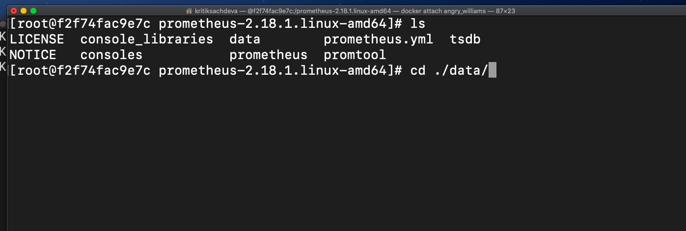

## Persistent data of Prometheus & Grafana persistent running on top of Kebernetes

### *Grafana:*
I have used the existing grafana public container image.

In **_grafana_** to make it's data persistent, we have to mount volumes ( as pvc ).

And the location where it is stored is:

*__Path:__* /var/lib/grafana/ 

(Here it stores all the dashboards created by the grafana portal)

### *Prometheus:*
 The similar approach is used with a difference that here the data is stored as sub directory **./data** in the home directory
 
 
 
And to be accessible from outside world, create serive configuration file with fixed port number, so that it wont
affect integration of both pods.


### Commands to be executed in the order on kubernetes cluster (**minikube**):
(Make the prometheus docker image)
* cd prometheus
* docker build -t prometheus:v1 .

**For Prometheus**
* cd resources/prometheus
* kubectl create -f prometheus_pvc.yml
* kubectl create -f prometheus_cm.yml
* kubectl create -f prometheus_deploy.yml
* kubectl create -f prometheus_service.yml

For storing configuration file, I have used the concept of yaml syntax and config maps a resource in kubernetes to store
the data in key-value format
Snippet of the code is
```
data:
  prometheus.yml: |
    global:
      scrape_interval:     15s
      evaluation_interval: 15s
    alerting:
      alertmanagers:
      - static_configs:
      - targets:
    rule_files:
     # - "first_rules.yml"
     # - "second_rules.yml"
    scrape_configs:
      - job_name: 'prometheus'
        static_configs:
        - targets: ['localhost:9090']
```

**For Grafana**
* cd resources/grafana
* kubectl create -f grafana_pvc.yml
* kubectl create -f grafana_deploy.yml
* kubectl create -f grafana_service.yml
